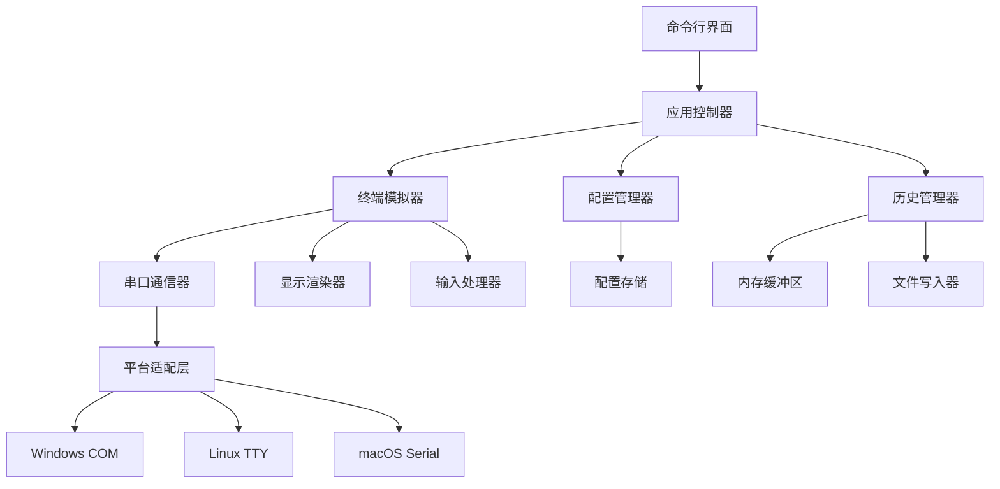

# 设计文档

## 概述

串口终端应用采用模块化架构设计，使用 Go 语言实现。应用分为串口通信层、终端模拟层、配置管理层和用户界面层。核心设计理念是高性能、跨平台兼容性和良好的用户体验。

## 架构

### 整体架构图



### 分层架构

1. **表示层** - CLI 界面和用户交互
2. **应用层** - 业务逻辑和流程控制
3. **服务层** - 核心功能模块（终端、配置、历史）
4. **基础设施层** - 串口通信和平台适配

## 组件和接口

### 1. 串口通信组件

```go
type SerialPort interface {
    Open(config SerialConfig) error
    Close() error
    Read(buffer []byte) (int, error)
    Write(data []byte) (int, error)
    IsOpen() bool
    GetConfig() SerialConfig
}

type SerialConfig struct {
    Port     string
    BaudRate int
    DataBits int
    StopBits int
    Parity   string
    Timeout  time.Duration
}
```

**设计决策：** 使用接口抽象串口操作，便于不同平台的实现和测试。采用 `github.com/tarm/serial` 或 `go.bug.st/serial` 作为底层串口库。

### 2. 终端模拟组件

```go
type Terminal interface {
    Start() error
    Stop() error
    ProcessInput(input []byte) error
    ProcessOutput(output []byte) error
    Resize(width, height int) error
    EnableMouse(enable bool) error
}

type TerminalEmulator struct {
    screen     *Screen
    parser     *VTParser
    serialPort SerialPort
    history    HistoryManager
}
```

**设计决策：** 实现 VT100/ANSI 终端模拟，使用状态机解析终端控制序列。集成 `github.com/gdamore/tcell` 用于终端 UI 渲染。

### 3. 配置管理组件

```go
type ConfigManager interface {
    SaveConfig(name string, config SerialConfig) error
    LoadConfig(name string) (SerialConfig, error)
    ListConfigs() ([]ConfigInfo, error)
    DeleteConfig(name string) error
    GetDefaultConfig() SerialConfig
}

type ConfigInfo struct {
    Name        string
    Config      SerialConfig
    CreatedAt   time.Time
    LastUsedAt  time.Time
}
```

**设计决策：** 使用 JSON 格式存储配置文件，支持配置的 CRUD 操作。配置文件存储在用户主目录的 `.sterm` 文件夹中。

### 4. 历史管理组件

```go
type HistoryManager interface {
    Write(data []byte, direction Direction) error
    Read(offset, length int) ([]byte, error)
    GetSize() int
    SaveToFile(filename string, format FileFormat) error
    Clear() error
    SetMaxSize(size int) error
}

type Direction int
const (
    DirectionInput Direction = iota
    DirectionOutput
)

type FileFormat int
const (
    FormatPlainText FileFormat = iota
    FormatTimestamped
    FormatJSON
)
```

**设计决策：** 使用环形缓冲区管理历史数据，支持大容量存储（默认 10MB）。当内存不足时，自动将旧数据写入临时文件。

## 数据模型

### 1. 会话数据模型

```go
type Session struct {
    ID          string
    Name        string
    Config      SerialConfig
    StartTime   time.Time
    EndTime     *time.Time
    DataSize    int64
    IsActive    bool
}
```

### 2. 历史记录数据模型

```go
type HistoryEntry struct {
    Timestamp time.Time
    Direction Direction
    Data      []byte
    Length    int
}
```

### 3. 终端状态数据模型

```go
type TerminalState struct {
    CursorX     int
    CursorY     int
    Width       int
    Height      int
    Attributes  TextAttributes
    MouseMode   MouseMode
    ScrollTop   int
    ScrollBottom int
}

type TextAttributes struct {
    Foreground Color
    Background Color
    Bold       bool
    Italic     bool
    Underline  bool
    Reverse    bool
}
```

## 错误处理

### 错误类型定义

```go
type ErrorType int
const (
    ErrorSerial ErrorType = iota
    ErrorConfig
    ErrorTerminal
    ErrorHistory
    ErrorFile
)

type AppError struct {
    Type    ErrorType
    Code    string
    Message string
    Cause   error
}
```

### 错误处理策略

1. **串口错误** - 自动重连机制，最多重试 3 次
2. **配置错误** - 回退到默认配置，记录错误日志
3. **终端错误** - 重置终端状态，继续运行
4. **历史记录错误** - 降级到内存模式，警告用户
5. **文件操作错误** - 提供替代路径，用户确认

## 测试策略

### 1. 单元测试

- **串口模拟器** - 使用虚拟串口对进行测试
- **终端解析器** - 测试各种 ANSI 序列的解析
- **配置管理** - 测试配置的保存、加载和验证
- **历史管理** - 测试大数据量的缓冲和文件操作

### 2. 集成测试

- **端到端通信** - 使用真实串口设备测试完整流程
- **跨平台测试** - 在 Windows、Linux、macOS 上验证功能
- **性能测试** - 测试高速数据传输和大缓冲区处理

### 3. 用户验收测试

- **真实设备测试** - 连接各种串口设备验证兼容性
- **长时间运行测试** - 验证内存管理和稳定性
- **用户体验测试** - 验证界面响应性和易用性

## 性能考虑

### 1. 内存管理

- 使用环形缓冲区避免频繁内存分配
- 实现分页机制处理大量历史数据
- 定期清理不活跃的数据

### 2. 并发处理

- 串口读写使用独立的 goroutine
- 终端渲染使用缓冲机制减少刷新频率
- 历史数据写入使用异步处理

### 3. 平台优化

- Windows: 使用 Windows API 优化 COM 端口访问
- Linux: 利用 epoll 提高 I/O 性能
- macOS: 使用 kqueue 进行事件处理

## 安全考虑

1. **输入验证** - 严格验证所有用户输入和配置参数
2. **文件权限** - 确保配置文件和历史文件的适当权限
3. **资源限制** - 限制内存使用和文件大小防止资源耗尽
4. **错误信息** - 避免在错误信息中泄露敏感信息